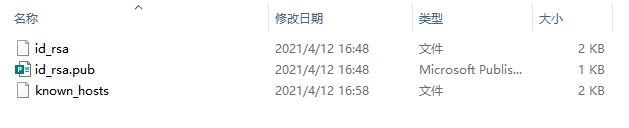

### SSH免密登录

1. 本地系统执行 ssh-keygen -t rsa 命令，生成密钥文件，如下图

    

2. 本地机器执行命令如：ssh-copy-id -i ~/.ssh/id_rsa.pub root@服务器IP， 将公钥文件传输的远程机器

    使用ssh时使用git bash，windows下没有ssh命令

3. 再次使用已经做免密处理的用户登录远程机器，已经不需要密码了，免密登录处理完成。

4. 登陆服务器， ssh root@ip地址